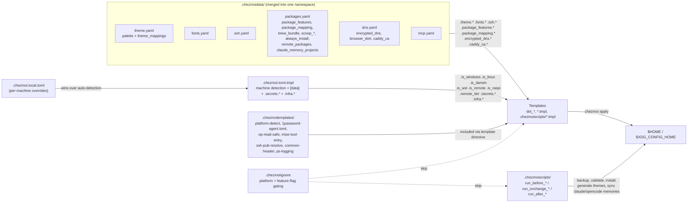

# Dotfiles (Chezmoi)

Modern, cross-platform dotfile management using [chezmoi](https://www.chezmoi.io/) for rapid machine provisioning.

**One command. Fresh machine. Ready in 10 minutes.** ⚡

---

## 🚀 Quick Start

### Windows (PowerShell)
```powershell
iwr -useb https://raw.githubusercontent.com/Randallsm83/chezmoi/main/bootstrap.ps1 | iex
```

### Windows — Restore from Scoop Export (fastest)
If you have a scoop export from a previous machine:
```powershell
# 1. Install scoop
irm get.scoop.sh | iex

# 2. Import all packages (buckets + apps in one shot)
scoop import .\scoop-export.json

# 3. Apply configs
chezmoi init --apply Randallsm83/chezmoi
```

Or use the bootstrap script with `-ScoopExport`:
```powershell
iwr -useb https://raw.githubusercontent.com/Randallsm83/chezmoi/main/bootstrap.ps1 -OutFile bootstrap.ps1
.\bootstrap.ps1 -ScoopExport .\scoop-export.json
```

> **Tip**: After setup, chezmoi keeps `~/.config/scoop/scoop-export.json` in sync with your feature flags — always ready for next time.

### Unix/Linux/WSL (bash/zsh)
```bash
curl -fsSL https://raw.githubusercontent.com/Randallsm83/chezmoi/main/setup.sh | bash
```

This single command will:
1. Install chezmoi (via the platform's package manager — scoop on Windows, the official `get.chezmoi.io` installer on Unix)
2. Clone this repository
3. Apply all configurations (with platform-specific templates)
4. Install the remaining package managers as needed — **Windows**: Scoop + Winget + Mise; **Linux/macOS**: Mise + Homebrew + system pkg manager (apt/dnf/pacman) for bootstrap essentials
5. Configure shell environments
6. Set up 1Password SSH agent integration
7. Ready to work 🎉

---

## 🔍 How it all fits together

At a glance, this is the chain a chezmoi apply follows from machine
detection through to the rendered files in `$HOME` and the lifecycle
scripts that fire alongside them.



Key rules of the road:
- Every `*.yaml` in `.chezmoidata/` is merged into the same template
  namespace; the file boundary is documentation, not isolation.
- `chezmoi.local.toml` overrides anything in the toml template;
  `[data]` in the toml template overrides `chezmoi data` defaults
  from `.chezmoidata/*.yaml`.
- `.chezmoiignore` is itself a template, so feature flags (and
  platform flags from `.chezmoi.toml.tmpl`) decide which files even
  get rendered.
- Reusable partials in `.chezmoitemplates/` (no `.tmpl` extension
  on disk) are included via `{{ template "<name>" . }}` and share the
  same data namespace.

---

## 📦 What's Included

### Core Tools (Always Installed)
- **Editors**: Neovim (LazyVim-based config)
- **Terminals**: WezTerm, Windows Terminal (Windows), Warp
- **Shell**: Zsh (Unix), PowerShell 7+ (Windows)
- **Prompt**: Starship styled through the unified theme data
- **Version Control**: Git with 1Password SSH agent
- **CLI Tools**: bat, eza, fzf, ripgrep, fd, delta, vivid, direnv, wget
- **Languages**: Managed by mise (node, python, ruby, go, rust, lua, bun)

### Optional Packages (Feature Flag Controlled)
Languages and tools are controlled by feature flags in `.chezmoidata/packages.yaml`.
The live values in that file are authoritative — the table below is a
snapshot for orientation.
<!-- Source of truth: .chezmoidata/packages.yaml package_features -->

**Group flags** (convenience shortcuts) currently enabled by default:
`essentials`, `shell_tools`, `languages`, `editors`, `terminals`,
`rust_alternatives`, `ai_tools`, `gaming`, `docker`, `hardware_tools`,
`windows_utilities`, `sysinternals`, `network_tools`, `dev_extras`,
`productivity`, `password_managers`, `browsers`, `media`, `vpn`,
`nerd_fonts`. Group flags do not force individual flags on; they are
mostly used by `package_mapping`/`always_install` to gate bulk package
lists. Individual flags below override per-package routing.

| Flag | Default | What it gates |
|------|---------|---------------|
| **Version control / auth** | | |
| `git` | ✅ | git + lazygit, glab, gh |
| `ssh` | ✅ | OpenSSH client packages |
| `1password` | ✅ | 1Password CLI/desktop + agent.toml |
| **Tool/runtime managers** | | |
| `mise` | ✅ | mise CLI + global tools |
| `direnv` | ✅ | `.envrc` evaluator (mise plugin) |
| `homebrew` | ✅ | active on Linux/macOS as a brew-bundle source |
| **Terminals** | | |
| `wezterm` | ✅ | wezterm + colorscheme |
| `warp` | ✅ | Warp terminal config |
| `windows_terminal` | ✅ | Windows Terminal settings |
| **Editors** | | |
| `nvim` | ✅ | neovim + LazyVim plugins |
| `vim` | ✅ | vim binary + `.vimrc` |
| `vscode` | ✅ | settings.json + extension installer |
| `zed` | ❌ | Zed settings only; install the app manually if needed |
| **Shell tools** | | |
| `starship` | ✅ | prompt |
| `zsh` | ✅ | zsh + zshrc.d |
| `powershell` | ✅ | pwsh + PSReadLine/PSFzf modules |
| `fzf` | ✅ | fuzzy finder |
| `wget` | ✅ | wget + curl |
| `thefuck` | ✅ | command-corrector |
| `fastfetch` | ✅ | system info display |
| `topgrade` | ✅ | cross-platform updater |
| `rust_alternatives` | ✅ | bat, rg, fd, eza, delta, zoxide, vivid, sd, dust, procs, hyperfine, tealdeer, navi, just, tokei, ouch, xh, coreutils, tin-summer, dog |
| **Language runtimes** | | |
| `rust` | ✅ | rustup + cargo |
| `golang` | ✅ | go toolchain |
| `python` | ✅ | python + uv + pipx |
| `ruby` | ✅ | ruby + gem |
| `lua` | ✅ | lua/luajit/luarocks + lua-language-server |
| `node` | ✅ | node@lts + yarn/bun/deno |
| `perl` | ✅ | Perl + perlnavigator-server |
| `julia` | ✅ | juliaup |
| `php` | ❌ | PHP runtime (heavy build deps) |
| **Dev tools / fonts** | | |
| `sqlite3` | ✅ | sqlite CLI |
| `arduino` | ✅ | arduino-cli + IDE config |
| `vagrant` | ❌ | off by default; enable per machine if needed |
| `nerd_fonts` | ✅ | Hack/FiraCode/JetBrainsMono/CascadiaCode NF |
| **AI / containers / hardware / networking** | | |
| `ai_tools` | ✅ | claude, opencode, scott |
| `docker` | ✅ | docker-compose + (darwin) OrbStack |
| `gaming` | ✅ | Steam, rtss, msiafterburner, ludusavi |
| `hardware_tools` | ✅ | (Windows) cpu-z, gpu-z, smartmontools, fancontrol, etc. |
| `windows_utilities` | ✅ | (Windows) Everything, Flow Launcher, Ventoy |
| `sysinternals` | ✅ | (Windows) Sysinternals Suite |
| `network_tools` | ✅ | bind, rclone, pritunl, unbound |
| `dev_extras` | ✅ | postman, pandoc, cygwin |
| `productivity` | ✅ | PowerToys, Obsidian, Notepad++, WizTree, AutoHotkey, OFGB |
| `password_managers` | ✅ | additional managers beyond 1Password (e.g. bitwarden-cli) |
| `browsers` | ✅ | Chrome, LibreWolf, Edge, Chromium (scoop) |
| `media` | ✅ | Spotify, Slack |
| `vpn` | ✅ | Tailscale, ProtonVPN, Pritunl |
| **Deprecated (off)** | | |
| `asdf` | ❌ | replaced by mise |
| `nvm` | ❌ | replaced by mise |
| `tinted_theming` | ❌ | replaced by the unified theme system |

**Total managed files**: ~200 in `dot_config/`, ~370 managed across all
platforms (varies by feature flag set). Counts include both regular files
and chezmoi-managed symlinks/scripts.

---

## 🎨 Theme & Appearance

**Unified Theme System**: All apps use a single theme setting in `.chezmoidata/theme.yaml`.

- **Active Theme**: Set via `theme.name` in `.chezmoidata/theme.yaml` (default: `spaceduck`). Override per machine in `chezmoi.local.toml` via `[data] theme = "..."`.
- **Available Themes**: spaceduck, onedark, gruvbox-material, tokyonight, tokyonight-storm, dracula, kanagawa
- **Apps Using Theme**: neovim, wezterm, starship, eza, vivid (LS_COLORS), bat, delta, opencode, Flow Launcher
- **Fonts**: Hack Nerd Font (primary), FiraCode Nerd Font (fallback with ligatures)

To change theme:
```yaml
# .chezmoidata/theme.yaml
theme:
  name: "onedark"  # Change this, run chezmoi apply
```

---

## 🧩 VS Code

VS Code is fully chezmoi-managed on the default profile:

| File in $HOME | Source in chezmoi | Notes |
|---|---|---|
| `%APPDATA%\Code\User\settings.json` | `AppData/Roaming/Code/User/settings.json.tmpl` | Theme, fonts, editor behavior, language overrides, vim/neovim, AI panels, Remote-SSH |
| `%APPDATA%\Code\User\keybindings.json` | symlink → `vscode/keybindings.json` | Custom keybinds |
| `%APPDATA%\Code\User\mcp.json` | symlink → `vscode/mcp.json` | MCP servers (currently empty) |
| `%APPDATA%\Code\User\tasks.json` | symlink → `vscode/tasks.json` | Default-profile tasks |
| `%APPDATA%\Code\User\extensions.json` | symlink → `vscode/extensions.json` | Workspace recommendations (not the install DB) |
| _installed extensions_ | `vscode/extensions.txt` | Driven by `run_onchange_after_70_vscode-extensions_*` |

### Extensions are auto-installed

`vscode/extensions.txt` is the single source of truth. One extension ID
per line, blank lines and `#` comments allowed. On every `chezmoi apply`,
the `run_onchange_after_70_vscode-extensions_{windows,unix}.{ps1,sh}.tmpl`
scripts diff the list against `code --list-extensions` and install only
the missing ones (additive — they never uninstall).

Gating:
- `package_features.vscode = true` (default in `.chezmoidata/packages.yaml`)
- `code` CLI on PATH (script skips silently if VS Code isn't installed yet)

To add or remove an extension:
```bash
chezmoi edit ~/.local/share/chezmoi/vscode/extensions.txt   # edit list
chezmoi apply                                               # installs missing
```

To force a re-run of the script after editing:
```bash
chezmoi state delete-bucket --bucket=scriptState
chezmoi apply
```

The `vscode/` directory is excluded from `$HOME` deployment via
`.chezmoiignore`; it's source-only data read by the install script
through `include`.

---

## 🦊 LibreWolf (Browser)

LibreWolf is installed as a Scoop portable app, but its **active profile**
still lives at the standard Firefox location: `%APPDATA%\LibreWolf\Profiles\<id>.default-default\`.
The scoop-shipped `~/scoop/persist/librewolf/Profiles/Default/` folder is
dead weight — LibreWolf does not read it. Always confirm via
`%APPDATA%\LibreWolf\profiles.ini` or `about:profiles`.

### What's tracked

Two files, both at non-XDG paths chezmoi can't reach via its normal target
walker. They live as source-only data and are deployed by
`.chezmoiscripts/run_onchange_after_55_librewolf_windows.ps1.tmpl`:

| Source                                  | Target                                                            | Owns                                                                        |
|-----------------------------------------|-------------------------------------------------------------------|-----------------------------------------------------------------------------|
| `librewolf/distribution/policies.json`  | `~/scoop/apps/librewolf/current/LibreWolf/distribution/policies.json` | Force-installed extensions, search-engine policy, telemetry/update lockdown |
| `librewolf/profile/user.js`             | `%APPDATA%\LibreWolf\Profiles\<id>.default-default\user.js`        | Network/fingerprinting hardening, cookies-on-shutdown, HTTPS-only, WebRTC off |

The profile id is generated per-install. The deploy script discovers it
at apply time by parsing `%APPDATA%\LibreWolf\profiles.ini` (preferring
the `[InstallXXX]` section's `Default=`, falling back to the first
`[ProfileN]` with `Default=1`).

### Force-installed extensions

Declared in `policies.json` under `ExtensionSettings` with
`installation_mode: "normal_installed"`. LibreWolf auto-installs them
from AMO on first profile launch. Current set: uBlock Origin, Bitwarden,
ClearURLs, LocalCDN, SponsorBlock, Dark Reader, Multi-Account Containers.

### Why these two files (and only these)?

- `prefs.js` is rewritten every session with cache state, build IDs,
  sessionstore data, etc. — unversionable.
- `extensions.json`, `extensions/`, sqlite databases, sessionstore
  backups: all browser-managed state. Fully derivable from
  `policies.json` + a fresh launch.
- `user.js` is read on every startup and overlaid onto `prefs.js`, so it
  is the canonical place for sticky preference overrides.
- `policies.json` is the canonical place for force-installed extensions
  and tenant-style policy. Without tracking it, scoop reinstalls or
  upgrades silently revert your extension list to LibreWolf stock.

### Adding a new preference

1. Make the change in the LibreWolf UI or `about:config`.
2. Edit `librewolf/profile/user.js` in the chezmoi source (don't edit
   the deployed copy in the active profile — the script overwrites it).
3. `chezmoi apply` (the run_onchange script picks up the new sha256 and
   writes it to the active profile).
4. Commit `librewolf/profile/user.js`.

### Adding a force-installed extension

1. Edit `librewolf/distribution/policies.json` — add an entry under
   `ExtensionSettings` with `installation_mode: "normal_installed"` and
   the AMO `install_url`.
2. `chezmoi apply` (deploys to the install dir).
3. Restart LibreWolf to trigger the auto-install on next profile load,
   or open `about:policies` to confirm the change is recognized.
4. Commit `librewolf/distribution/policies.json`.

### Backups & references

Detailed setup notes (privacy prefs rationale, search-engine policy,
restore/rollback procedures, verification steps) live in the personal
notes vault at `02 Atlas/Reference/Windows/LibreWolf Setup.md`.

---

## 🛠️ Manual Setup (Development)

For development or testing without running the bootstrap:

### 1. Install Chezmoi
```powershell
# Windows
scoop install chezmoi

# Unix/Linux
sh -c "$(curl -fsLS get.chezmoi.io)"
```

### 2. Initialize from this repository
```bash
chezmoi init --apply Randallsm83/chezmoi
```

### 3. Verify and update
```bash
# See what would change
chezmoi diff

# Apply changes
chezmoi apply

# Update from repository
chezmoi update
```

---

## ⚙️ Configuration

### Enable/Disable Packages

Edit `.chezmoidata/packages.yaml` (chezmoi source directory):

```yaml
package_features:
  rust: true      # Enable rust
  python: false   # Disable python
```

Or override per-machine without touching the tracked source by editing
`chezmoi.local.toml` (gitignored; see `chezmoi.local.toml.example`):

```toml
[data.package_features]
rust = false
golang = false
```

Then apply:
```bash
chezmoi apply
```

### Platform-Specific Configs

Configs automatically adapt to your platform:
- **Windows**: PowerShell profile, Windows Terminal settings, WSL config
- **Unix/Linux**: Zsh config, shell integrations
- **WSL**: Special detection and configuration (1Password SSH agent shared from the Windows host via named-pipe relay)
- **macOS**: Homebrew integration (cask list derived from `package_mapping.<feature>.darwin.cask`)

### Package Management

- **Windows**: Mise (language runtimes and supported CLI tools), Scoop (remaining CLI/bootstrap tools), Winget (GUI)
- **Linux/macOS/WSL**: Mise (everything, no sudo) + Homebrew (build deps + casks on macOS) + apt/dnf/pacman (system bootstrap only when sudo is available)

Package routing lives in `.chezmoidata/packages.yaml`:
- `package_mapping.<feature>.{windows,linux,darwin}.{scoop,winget,brew,apt,dnf,pacman,mise,mise_remote,cask}` — per-feature, per-platform package names
- `brew_bundle.*` — extra Homebrew bundle entries
- `scoop_buckets` / `scoop_bucket_overrides` — Scoop bucket setup
- `always_install.*` — packages installed regardless of feature flags
- `remote_packages.<tier>` — minimal / medium / full package sets for remote machines

#### Discovering tools before adding them to mise

`mpm` is installed as `pipx:meta-package-manager` and is useful for searching
package-manager registries, but its output is not a guaranteed mise target. A
registry hit can be a library package, a GUI package, or an OS package with no
direct mise backend.

Use the PowerShell helper `mpmise` to search with `mpm` and verify plausible
mise spellings with `mise install --dry-run`:

```powershell
mpmise dog -Manager cargo,winget -GitHubRepo ogham/dog
```

Result statuses:
- `OK` — the target resolves through a mise backend such as `github:` or `aqua:`.
- `CHECK` — mise accepts the ecosystem package target (`cargo:`, `npm:`, `gem:`,
  `pipx:`), but dry-run does not prove the package exposes a CLI binary.
- `FAIL` — the mise target did not resolve.

Rules of thumb:
- `cargo:<name>` can still fail at real install time if the crate has no binaries.
- `npm:<name>`, `gem:<name>`, and `pipx:<name>` can resolve but still may not
  provide the CLI you expected.
- `scoop` and `winget` results are discovery signals, not direct mise backends.
- For GitHub-release CLIs, pass `-GitHubRepo owner/repo` so the helper checks
  `github:owner/repo` and `aqua:owner/repo`.

---

## 📁 Repository Structure

```
.local/share/chezmoi/                       # Chezmoi source directory
├── .chezmoi.toml.tmpl                      # Machine detection + [data] + .secrets.*
├── chezmoi.local.toml.example              # Template for per-machine overrides (real
│                                           # file lives at ~/.local/share/chezmoi/
│                                           # chezmoi.local.toml, gitignored)
├── .chezmoidata/                           # Static template data (merged into one namespace)
│   ├── theme.yaml                          # theme.* + theme_mappings.*
│   ├── fonts.yaml                          # fonts.* (Nerd Font choices, ligatures)
│   ├── ssh.yaml                            # ssh.* (1Password agent paths)
│   ├── packages.yaml                       # package_features, package_mapping,
│   │                                       # brew_bundle, scoop_*, always_install,
│   │                                       # remote_packages, claude_memory_projects
│   ├── dns.yaml                            # encrypted_dns, browser_doh, caddy_ca
│   └── mcp.yaml                            # mcp.* server definitions
├── .chezmoiignore                          # Platform + feature-flag gating (itself a template)
├── .chezmoiscripts/                        # Auto-run scripts (run_before_* / run_onchange_* / run_after_*)
├── .chezmoitemplates/                      # Reusable partials (platform-detect, op-read-safe,
│                                           # 1password-agent.toml, mise-tool-entry,
│                                           # ssh-pub-resolve, common-header, ps-logging)
│
├── dot_config/                             # → ~/.config/ (XDG)
│   ├── git/                                # Git configuration
│   ├── nvim/                               # Neovim configuration (LazyVim-based)
│   ├── wezterm/                            # WezTerm terminal
│   ├── starship/                           # Starship prompt
│   ├── mise/                               # Mise version manager
│   ├── zsh/                                # Zsh configuration + dot_zshrc.d/
│   └── [language packages]                 # Language-specific configs
│
├── Documents/PowerShell/                   # → ~/Documents/PowerShell/ (Windows pwsh profile)
├── AppData/Roaming/Code/User/              # → %APPDATA%\Code\User\ (VS Code settings)
├── dot_local/bin/                          # → ~/.local/bin/ (local scripts)
├── dot_cache/zsh/                          # → ~/.cache/zsh/ (zsh completions)
├── librewolf/                              # LibreWolf source-only data (deployed by script)
├── vscode/                                 # VS Code source-only data (extensions.txt, etc.)
│
├── bootstrap.ps1                           # Windows bootstrap script
├── bootstrap.Tests.ps1                     # Pester tests for bootstrap.ps1
├── setup.sh                                # Unix bootstrap script
├── scripts/                                # Utility scripts (healthcheck, rollback, etc.)
├── AGENTS.md                               # Agent / human technical reference
└── README.md                               # This file
```

---

## 🗂️ Workspace Layout & Shell Shortcuts

The shells export a small set of environment variables that describe the local workspace, plus matching `cd`-style shortcuts. All paths derive from `$HOME` — no machine-specific absolute paths in the dotfiles.

### Environment variables

Exported from `dot_config/zsh/dot_zshrc.d/10-dirs.zsh` (zsh) and `Documents/PowerShell/Scripts/99-aliases.ps1` (pwsh):

| Var | Value | Purpose |
|---|---|---|
| `PROJECTS` | `$HOME/projects` | General projects root |
| `DHSPACE` | `$PROJECTS/dh` | DreamHost workspace |
| `BACKEND` | `$DHSPACE/BACKEND` | Backend service repos |
| `FRONTEND` | `$DHSPACE/FRONTEND` | Frontend dashboard repos |
| `HELPSERVICES` | `$DHSPACE/HELPSERVICES` | Supporting service repos |
| `NOTES` | `$PROJECTS/notes` | Obsidian vault |
| `MYSPACE` | `$HOME/Dev` | Personal dev space (zsh only) |
| `DOTFILES` | `$HOME/.local/share/chezmoi` (pwsh) / `$XDG_CONFIG_HOME/dotfiles` (zsh) | Chezmoi source dir — see note below |

On Windows, `$HOME/projects` is a junction to `D:\`, so `DHSPACE` resolves to `D:\dh`, `NOTES` to `D:\notes`, etc.

> **Note**: zsh's `DOTFILES` currently points to `$XDG_CONFIG_HOME/dotfiles` ([`dot_config/zsh/dot_zshrc.d/10-dirs.zsh`](dot_config/zsh/dot_zshrc.d/10-dirs.zsh)), while pwsh points to the real chezmoi source dir at `$HOME/.local/share/chezmoi`. The `dots` alias is therefore only reliable on pwsh until the zsh value is aligned.

### Navigation shortcuts

zsh aliases and pwsh functions (pwsh functions are only defined when the target directory exists):

| Command | Goes to | Notes |
|---|---|---|
| `cdp` | `$PROJECTS` | general projects root |
| `dh` | `$DHSPACE` | DH workspace |
| `cdbe` / `cdfe` / `cdhs` | `$BACKEND` / `$FRONTEND` / `$HELPSERVICES` | service-tree roots |
| `dots` | `$DOTFILES` | chezmoi source |
| `notes` | `$NOTES` | Obsidian vault |
| `cdn` | `$DHSPACE/ndn` | top-level DH repo |
| `cdaudit` | `$DHSPACE/ndn-audit` | top-level DH repo |
| `cdscott` | `$DHSPACE/scott` | top-level DH repo |
| `cdtm` | `$DHSPACE/task-management` | top-level DH repo |
| `cdapi` | `$BACKEND/api-gateway` | common backend service |
| `cdcdn` | `$BACKEND/cdn-service` | common backend service |

zsh also exposes the longer-form aliases `backend`, `frontend`, `helpservices` as synonyms for `cdbe`/`cdfe`/`cdhs`.

### `dhgitall`

Runs a `git` command across every repo under `$BACKEND/`, `$FRONTEND/`, and `$HELPSERVICES/`. Entries without a `.git` directory are skipped. Top-level repos under `$DHSPACE` (ndn, ndn-audit, scott, task-management) are **intentionally excluded** — run git commands against them individually.

```bash
dhgitall status -sb           # quick status across all service repos
dhgitall fetch --prune
dhgitall checkout main
```

Defined in:
- `dot_config/zsh/dot_zshrc.d/25-functions.zsh` (zsh)
- `Documents/PowerShell/Scripts/lib/99-functions-body.ps1` (pwsh)

---

## 🔧 Common Tasks

### Update Dotfiles
```bash
# Pull latest changes and apply
chezmoi update
```

### Edit a Config
```bash
# Edit in chezmoi source
chezmoi edit ~/.config/nvim/init.lua

# Or edit and apply immediately
chezmoi edit --apply ~/.gitconfig
```

### Add New File
```bash
# Add existing file to chezmoi
chezmoi add ~/.config/myapp/config.yml

# Add as template (for platform-specific content)
chezmoi add --template ~/.config/myapp/config.yml
```

### View Managed Files
```bash
# List all managed files
chezmoi managed

# Count managed files
chezmoi managed | wc -l
```

### Test Changes
```bash
# See what would change (safe)
chezmoi diff

# Dry-run apply
chezmoi apply --dry-run --verbose
```

---

## 🔐 Secrets & SSH

### 1Password SSH Agent Integration

SSH keys are managed by 1Password SSH agent:
- **Windows**: Named pipe (`\\.\pipe\openssh-ssh-agent`)
- **Unix**: Socket (`~/.1password/agent.sock`)

Git is configured to use 1Password for SSH authentication automatically.

### Setup 1Password SSH Agent
1. Install 1Password 8+
2. Enable SSH agent in settings
3. Add SSH keys to 1Password
4. Configs automatically use the agent

### OMP homelab auth

The `omp` shell wrapper (zsh and pwsh) talks to a self-hosted auth broker on the Raspberry Pi homelab. It prefers a local `~/.omp/auth-broker.token` when present (setting the broker URL/token for that process only) and otherwise falls back to `op run` so credentials are resolved from 1Password at invocation. Shared agent settings live under `dot_omp/agent/` ([`dot_omp/agent/config.yml.tmpl`](dot_omp/agent/config.yml.tmpl)); no tokens are ever written into the source tree.

---

## 🐧 WSL-Specific Notes

Windows Subsystem for Linux is fully supported:
- `.wslconfig` template for WSL2 settings
- Automatic WSL detection in configs
- 1Password SSH agent integration via npipe
- Zsh as default shell with full config

---

## 📝 History

This repository replaced an earlier GNU Stow-based dotfiles layout. The
chezmoi rewrite kept the look-and-feel and migrated everything to
template-driven, platform-aware provisioning:

- One-command provisioning across Windows / Linux / macOS / WSL
- Template-based platform detection (`.is_windows`, `.is_linux`, `.is_darwin`, `.is_wsl`, `.is_remote`, `.is_raspi`)
- Feature flags for optional packages
- Integrated bootstrap scripts (`bootstrap.ps1` + `setup.sh`)
- 1Password / Age-based secrets management
- Mirrored to GitHub (`github`) and GitLab (`origin`); see `CONTRIBUTING.md` for the `git pushall` / `git land` workflow

---

## 📚 Documentation

- [Chezmoi Documentation](https://www.chezmoi.io/)
- [AGENTS.md](AGENTS.md) — AI agent / human technical reference (architecture, commands, conventions)
- [ARCHITECTURE.md](ARCHITECTURE.md) — design decisions, directory structure, security model
- [INSTALL-GUIDE.md](INSTALL-GUIDE.md) — full installation walkthrough across all platforms
- [CHEZMOI-GUIDE.md](CHEZMOI-GUIDE.md) — chezmoi concepts and workflow reference
- [SECRETS.md](SECRETS.md) — 1Password / Age integration patterns
- [REMOTE.md](REMOTE.md) — remote/SSH machine model and tiers
- [RASPI.md](RASPI.md) — Raspberry Pi homelab zsh profile
- [DNS.md](DNS.md) — split-DNS, encrypted DNS, browser DoH policy
- [REINSTALL.md](REINSTALL.md) — rebuild / reset scenarios
- [CONTRIBUTING.md](CONTRIBUTING.md) — branch naming, commit conventions, mirrored-remote workflow
- [CHANGELOG.md](CHANGELOG.md) — release notes

---

## 🤝 Contributing

This is a personal dotfiles repository, but feel free to:
- Fork for your own use
- Open issues for bugs
- Submit PRs for improvements

---

## 📜 License

MIT License - Feel free to use and modify for your own dotfiles!

---

**Made with ❤️ using [chezmoi](https://www.chezmoi.io/)**

*Last updated*: 2026-07-10
*Managed files*: ~200 in `dot_config/`, ~370 managed total (varies per platform)  
*Platforms*: Windows, Linux, WSL, macOS, Raspberry Pi
